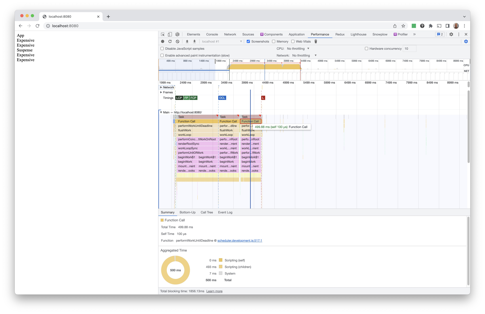
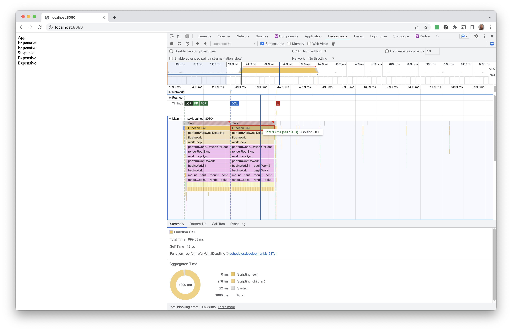

# react-suspense-non-blocking-hydration

## Development

```console
$ yarn
$ npm run compile:watch
$ npm run start:server
```

The app renders two `Expensive` components outside of `Suspense` and another two inside of `Suspense`.

Each `Expensive` component takes 500ms to render.

## Expected: non-blocking

The hydration for the two `Expensive` components inside the `Suspense` boundary should be in the form of two tasks lasting 500ms each:



## Actual: blocking

The hydration for the two `Expensive` components inside the `Suspense` boundary is in the form of a single task lasting 1 second:


